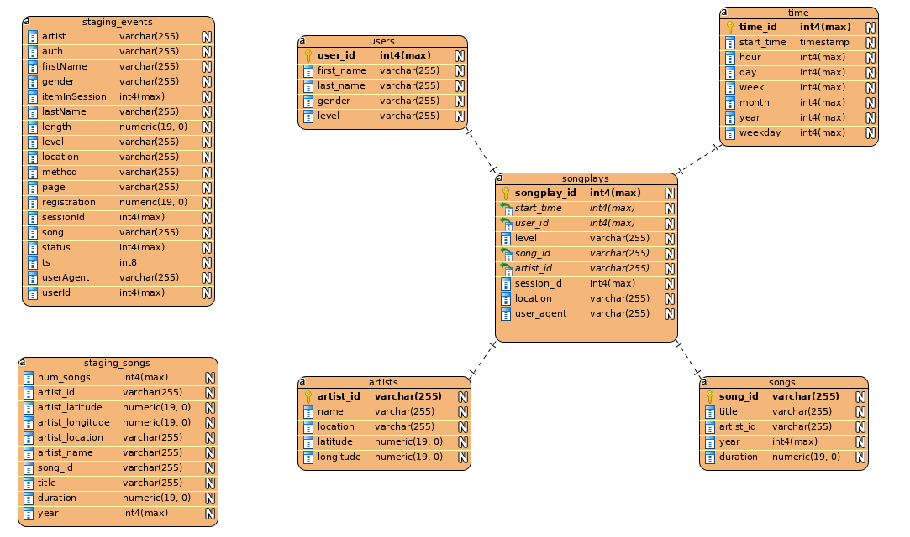

# Sparkify Redshift OLAP database
This is project 3 in Udacity's data engineering nanodegree (DEND).  The infrastructure-as-code part was interesting and useful, and probably my favorite part.

## Introduction from Udacity
"A music streaming startup, Sparkify, has grown their user base and song database and want to move their processes and data onto the cloud. Their data resides in S3, in a directory of JSON logs on user activity on the app, as well as a directory with JSON metadata on the songs in their app."
--Udacity DEND


## 1. Purpose of the project and database in context of the startup, Sparkify, and the analytical goals.

Sparkify is a fictional music startup similar to Spotify.  They're starting to get a lot of data from their music-playing app which is stored in JSON files on AWS S3.  The idea here is to extract this data from S3 JSON files into a star schema database on AWS Redshift, which will allow for analytics on song plays and users in their app.  The analytics results will be used to improve the business by making informed business decisions.  

## 2. Database schema design and ETL pipeline.

The database schema is a star schema, which is common for analytics work.  The fact table holds data we use to analyze (like song plays and user subscription levels), which the adjacent dimension tables hold things like the users' names, song names, and so on.  The ERD is shown below.



To ETL the data into the star schema, the raw JSON files are first loaded into staging tables.  This allows us to read in the raw data quickly, since they are in multiple parts, and each slice on Redshift can read a part in parallel.  Once the data is in the the staging tables, we then extract the relevant data for the fact and dimension tables, do any required conversions (e.g. timestamp from ms since the epoch), and store it in the star schema tables.  The data is selected as DISTINCT to avoid duplicates, which is especially important for the users and artists tables.

## 3. Example queries and results for song play analysis.

Example queries are in `test_queries.ipynb` and also follow below.  These are how you might start analyzing the data, although you want want to target free->premium user conversion for analysis.

- Get the top 10 most-played songs:

```sql
SELECT songs.title, COUNT(songs.title) as play_count
FROM songplays
JOIN songs
ON songplays.song_id = songs.song_id
GROUP BY songs.title
ORDER BY play_count DESC LIMIT 10;
```

- Result:
```
("You're The One", 37)
("I CAN'T GET STARTED", 9)
('Catch You Baby (Steve Pitron & Max Sanna Radio Edit)', 9)
("Nothin' On You [feat. Bruno Mars] (Album Version)", 8)
("Hey Daddy (Daddy's Home)", 6)
('Make Her Say', 5)
('Up Up & Away', 5)
('Unwell (Album Version)', 4)
('Mr. Jones', 4)
('Supermassive Black Hole (Album Version)', 4)
```


- Get the number of users in the different levels:

```sql
SELECT level, COUNT(level) level_count
FROM songplays
GROUP BY level
ORDER BY level_count DESC;
```

- Result:
```
('paid', 271)
('free', 62)
```


## Misc
I used the [Visual Paradigm](https://www.visual-paradigm.com/download/) tool to convert my SQL CREATE statements (DDL statements) into an ERD.  Visual Paradigm's [import](https://circle.visual-paradigm.com/docs/database-design-engineering/database-management-guide/how-to-reverse-engineer-erd-from-ddl/) does not know about RedShift's IDENTITY function, so I had to remove it from the .sql file with CREATE TABLE statements.